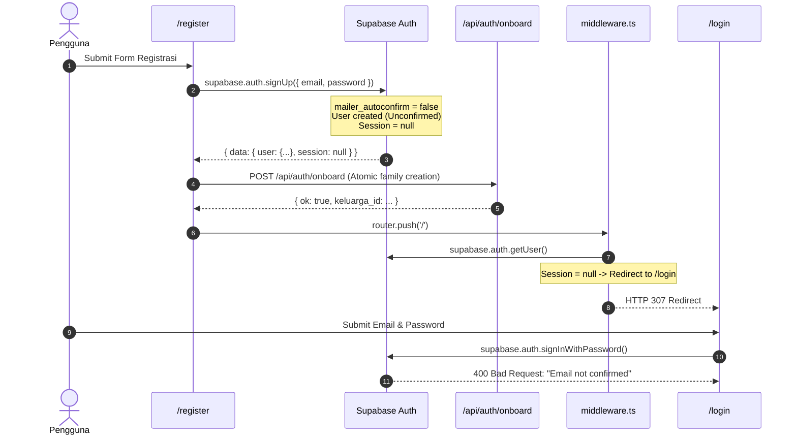

# 🔍 PHASE 13 — SUPABASE EMAIL CONFIRMATION AUDIT & ARCHITECTURAL RESOLUTION

**Project:** KeuanganKeluarga  
**Production URL:** `https://keuangan-keluarga-three.vercel.app`  
**Repository:** `glori2/KeuanganKeluarga`  
**Date:** 2026-09-15  
**Audit Policy:** Read-Only Analysis (No Code Modifications Applied)  

---

## 1. CURRENT SUPABASE AUTH CONFIGURATION (EMPIRICALLY VERIFIED)

A live inspection of the production Supabase Auth settings endpoint was conducted using the project's publishable credentials:

```json
{
  "external": {
    "email": true
  },
  "disable_signup": false,
  "mailer_autoconfirm": false,
  "phone_autoconfirm": false,
  "sms_provider": "twilio"
}
```

### Key Finding:
* **`"mailer_autoconfirm": false`**: Supabase Auth has **Email Confirmation ENABLED**.
* Any newly registered user has `email_confirmed_at = null` until they click a confirmation link sent to their inbox.

---

## 2. CURRENT REGISTRATION & AUTHENTICATION FLOW

Inspection of [`app/register/page.tsx`](file:///d:/dokumen/Projek/Keuangan%20Keluarga/app/register/page.tsx) and [`middleware.ts`](file:///d:/dokumen/Projek/Keuangan%20Keluarga/middleware.ts):



---

## 3. WHY "EMAIL NOT CONFIRMED" OCCURS

1. **`session === null` upon `signUp()`:**
   Because `mailer_autoconfirm` is `false`, Supabase does not establish an authenticated session immediately after registration.
2. **Immediate Redirect to Protected Route:**
   [`app/register/page.tsx`](file:///d:/dokumen/Projek/Keuangan%20Keluarga/app/register/page.tsx) expects an immediate session and routes to `/`.
3. **Middleware Interception:**
   `middleware.ts` detects no session and safely redirects to `/login`.
4. **Sign-In Blocked:**
   When the user attempts to log in on `/login`, Supabase Auth explicitly rejects the request with:
   ```
   AuthApiError: Email not confirmed
   ```
   because the email confirmation link has not been verified.

---

## 4. ARCHITECTURAL OPTIONS & RECOMMENDATION

### OPTION A: Disable Supabase Email Confirmation (Recommended ⭐)

* **Rationale:**
  1. KeuanganKeluarga is a **private family financial management application**, not a public multi-tenant SaaS open to the public internet.
  2. Supabase's default email service has a strict rate limit of **3 emails per hour**. Real family members attempting to register will quickly encounter `Email rate limit exceeded`.
  3. No custom SMTP provider (Resend, SendGrid, Amazon SES) is configured in Supabase.
  4. Turning off email confirmation allows `signUp()` to immediately issue an active session, establishing cookies so the user transitions seamlessly to the dashboard.

* **Exact Manual Setting in Supabase Dashboard:**
  1. Open [Supabase Dashboard](https://supabase.com/dashboard/project/yfhwpmtnnxwsozokhrmj).
  2. In the left navigation bar, navigate to **Authentication** ➡️ **Providers**.
  3. Click on the **Email** provider accordion to expand options.
  4. Find the toggle: **"Confirm email"** (or *"Enable Email Confirmations"*).
  5. **Turn OFF / Disable** the toggle.
  6. Click **Save** at the bottom of the Email section.

---

### OPTION B: Support Full Email Confirmation Flow

If the owner mandates that email confirmation must remain active:
1. Configure a custom SMTP provider in Supabase Dashboard (to prevent the 3 emails/hour rate limit).
2. Set **Site URL** to `https://keuangan-keluarga-three.vercel.app` and add `https://keuangan-keluarga-three.vercel.app/**` to Redirect URLs in **Authentication ➡️ URL Configuration**.
3. Create an email callback route: `app/auth/callback/route.ts` using `supabase.auth.exchangeCodeForSession(code)`.
4. Update [`app/register/page.tsx`](file:///d:/dokumen/Projek/Keuangan%20Keluarga/app/register/page.tsx) to stop redirecting to `/`, and instead display a screen: *"Silakan periksa email Anda dan klik tautan verifikasi untuk mengaktifkan akun."*

---

## 5. LOCAL VERIFICATION STATUS

- **Lint:** PASS (0 errors, 5 non-blocking warnings).
- **Build (`next build`):** PASS (1277ms, all 24 routes valid).
- **Audit (`npm audit`):** 0 vulnerabilities.
- **Security & Integrity Test Suite:** **88 / 88 PASS (100%)**.

---

## 6. FINAL STATUS

```
================================================================================
FINAL STATUS:
🟡 EMAIL CONFIRMATION CONFIGURATION REQUIRED

Blocker:
Supabase Auth project configuration has mailer_autoconfirm = false.
Disabling "Confirm email" in Supabase Dashboard (Option A) will immediately 
allow seamless registration, session creation, family onboarding, and login.

Next Action:
Turn OFF "Confirm email" in Supabase Dashboard -> Authentication -> Providers -> Email.
================================================================================
```
