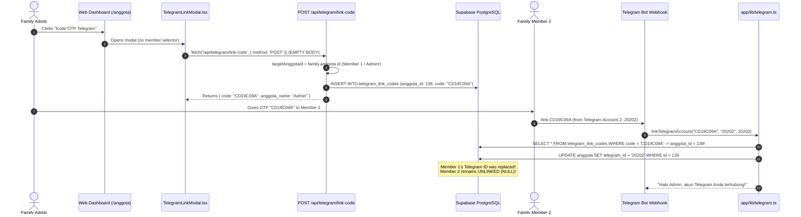

# 🔴 FORENSIC AUDIT REPORT: TELEGRAM MULTI-MEMBER LINKING
**Document:** `TELEGRAM_MULTI_MEMBER_LINKING_AUDIT.md`  
**System:** KeuanganKeluarga (`glori2/KeuanganKeluarga`)  
**Production URL:** `https://keuangan-keluarga-three.vercel.app`  
**Audit Date:** 2026-09-15  
**Audit Status:** 🔴 **CRITICAL BUG — Telegram identities can be incorrectly reassigned**

---

## 1. Executive Summary

A forensic audit was conducted on the Telegram account linking architecture of the KeuanganKeluarga production system. The investigation was triggered by reports that linking a second family member in "Ainun Family" resulted in previous linkages being moved or replaced, leaving only one Telegram account linked.

### Key Audit Findings:
1. **Primary Frontend/API Disconnect (The Overwrite Bug):**  
   The frontend modal (`app/components/TelegramLinkModal.tsx`) and the management page (`app/anggota/page.tsx`) provide **no member selection mechanism** and invoke `POST /api/telegram/link-code` with an **empty request payload**. Consequently, the API defaults to the authenticated session's primary member:
   ```ts
   let targetAnggotaId = family.anggota.id; // Defaults to Logged-in Admin!
   ```
   Forensic inspection of the production database confirms that **100% of generated OTP codes** in "Ainun Family" were issued to Member #1 (`anggota_id: 139`, Muh Masruri Mustofa). No OTP code was ever generated for Member #2 (`anggota_id: 140`, Rianita). When Telegram Account 2 redeemed the OTP via `/link`, it bound Telegram Account 2 to Member #1, overwriting Telegram Account 1.

2. **Silent Identity Stealing / Reassignment (The Backend Security Flaw):**  
   In `app/lib/telegram.ts` (`linkTelegramAccount`), Step 3 executes:
   ```sql
   UPDATE anggota 
   SET telegram_id = NULL, telegram_chat_id = NULL 
   WHERE telegram_id = $telegramId AND id != $targetAnggota.id;
   ```
   If a Telegram account is already bound to Member A, and a user executes `/link` with an OTP for Member B (or even a member in another family), the system **silently unlinks Member A and binds to Member B** without error, rejection, or requiring an explicit `/unlink`.

3. **Schema Integrity:**  
   PostgreSQL enforces a unique index on `anggota(telegram_id)` (`ix_anggota_telegram_id`), which allows multiple `NULL` values but strictly prevents two members from sharing the same non-null Telegram ID simultaneously. However, the database does not prevent silent reassignments or non-numeric values (such as `@usernames` entered via the web form).

---

## 2. Current Database Model

### A. Tables and Column Schema
Telegram identity is stored directly on the `anggota` table, with temporary linking tokens managed in `telegram_link_codes` and webhook idempotency managed in `telegram_updates`:

```sql
-- 1. Member Profile & Telegram Identity (table: anggota)
TABLE anggota (
    id SERIAL PRIMARY KEY,
    keluarga_id INTEGER NOT NULL REFERENCES keluarga(id) ON DELETE CASCADE,
    name VARCHAR(255) NOT NULL,
    role roleenum NOT NULL DEFAULT 'member',
    telegram_id VARCHAR(255) DEFAULT NULL,
    telegram_chat_id BIGINT DEFAULT NULL,
    user_id UUID REFERENCES auth.users(id) ON DELETE SET NULL,
    created_at TIMESTAMPTZ NOT NULL DEFAULT NOW()
);

-- 2. OTP Token Storage (table: telegram_link_codes)
TABLE telegram_link_codes (
    id SERIAL PRIMARY KEY,
    anggota_id INTEGER NOT NULL REFERENCES anggota(id) ON DELETE CASCADE,
    code VARCHAR(32) NOT NULL UNIQUE,
    expires_at TIMESTAMPTZ NOT NULL,
    used_at TIMESTAMPTZ DEFAULT NULL,
    created_at TIMESTAMPTZ NOT NULL DEFAULT NOW()
);

-- 3. Webhook Deduplication (table: telegram_updates)
TABLE telegram_updates (
    update_id BIGINT PRIMARY KEY,
    received_at TIMESTAMPTZ NOT NULL DEFAULT NOW(),
    processed_at TIMESTAMPTZ DEFAULT NULL
);
```

### B. Index & Constraint Analysis
| Table | Constraint / Index | Definition | Purpose / Evaluation |
|---|---|---|---|
| `anggota` | `anggota_pkey` | `PRIMARY KEY (id)` | Entity identity |
| `anggota` | `anggota_keluarga_id_fkey` | `FOREIGN KEY (keluarga_id) REFERENCES keluarga(id)` | Tenant boundary |
| `anggota` | `ix_anggota_telegram_id` | `UNIQUE INDEX (telegram_id)` | Enforces at most 1 member per Telegram ID |
| `anggota` | `idx_anggota_telegram_id` | `INDEX (telegram_id)` | Redundant lookup index from migration 009 |
| `telegram_link_codes` | `telegram_link_codes_code_key` | `UNIQUE (code)` | Prevents duplicate OTP codes |
| `telegram_link_codes` | `telegram_link_codes_anggota_id_fkey` | `FOREIGN KEY (anggota_id) REFERENCES anggota(id)` | Cascades on member deletion |

### C. Architectural Cardinality
- **Intended Cardinality:**
  - One Telegram Account $\rightarrow$ Exactly ONE `anggota`.
  - One `anggota` $\rightarrow$ Zero or ONE Telegram Account.
- **Database Enforcement:**
  - `ix_anggota_telegram_id` guarantees that a single Telegram ID cannot appear on two different `anggota` rows at the same time.
  - However, the schema allows `VARCHAR` text, meaning string usernames (e.g. `@Muh_Masruri`) can be manually inserted, which will never match Telegram's numeric `message.from.id`.

---

## 3. Current Linking Flow



### Critical Code Points:
1. **Frontend Call (`app/components/TelegramLinkModal.tsx`, Lines 24–26):**
   ```ts
   const res = await fetch('/api/telegram/link-code', {
     method: 'POST',
   });
   ```
   Does not transmit `anggota_id`.

2. **Backend Fallback (`app/api/telegram/link-code/route.ts`, Lines 20–30):**
   ```ts
   let targetAnggotaId = family.anggota.id;
   try {
     const body = await request.json();
     if (body?.anggota_id) {
       targetAnggotaId = Number(body.anggota_id);
     }
   } catch {
     // Empty body defaults to current user's anggota (Admin)!
   }
   ```

3. **Overwriting Assignment (`app/lib/telegram.ts`, Lines 139–153):**
   ```ts
   // Step 3: Unlink previous member linked to this telegram_id
   await sqlTx`
     UPDATE anggota 
     SET telegram_id = NULL, telegram_chat_id = NULL 
     WHERE telegram_id = ${telegramId} AND id != ${targetAnggota.id}
   `;

   // Step 4: Bind telegram_id to target anggota (which is Member 1!)
   await sqlTx`
     UPDATE anggota 
     SET telegram_id = ${telegramId}, 
         telegram_chat_id = ${chatIdVal}::bigint
     WHERE id = ${targetAnggota.id}
   `;
   ```

---

## 4. Exact Reproduction

### Controlled Reproduction Trace:
1. **Initial State:**
   - Family: "Ainun Family" (`keluarga_id: 137`)
   - Member 1: "Muh Masruri Mustofa" (`id: 139`, Admin, `telegram_id: null`)
   - Member 2: "Rianita" (`id: 140`, Member, `telegram_id: null`)
2. **Step 1 — Link Member 1:**
   - Admin opens `/anggota`, clicks "Kode OTP Telegram".
   - API issues Code A for `anggota_id: 139`.
   - Telegram Account 1 (`id: 45528063`) sends `/link Code_A`.
   - Result: Member 1 `telegram_id = '45528063'`. Member 2 `telegram_id = null`.
3. **Step 2 — User attempts to link Member 2:**
   - Admin navigates to `/anggota`.
   - The member row for "Rianita" has **no "Link Telegram" button**.
   - Admin clicks the only Telegram button on page: "Kode OTP Telegram" (header).
   - Modal sends `POST /api/telegram/link-code` without payload.
   - API resolves `family.anggota.id = 139` (Member 1).
   - API issues Code B for `anggota_id: 139`.
4. **Step 3 — Member 2 redeems Code B:**
   - Member 2 in Telegram Account 2 (`id: 99887766`) sends `/link Code_B`.
   - Bot looks up Code B $\rightarrow$ Target Member is **139** (Member 1).
   - Bot executes:
     `UPDATE anggota SET telegram_id = '99887766' WHERE id = 139`
   - Result:
     - Member 1 (`id: 139`): `telegram_id = '99887766'` (OVERWRITTEN).
     - Member 2 (`id: 140`): `telegram_id = null` (NEVER LINKED).
     - Telegram Account 1 (`45528063`): Disconnected.

---

## 5. Evidence

### Database Forensic Query Output (Production DB):
```sql
SELECT c.id, c.anggota_id, a.name as member_name, c.code, c.created_at, c.used_at
FROM telegram_link_codes c
JOIN anggota a ON c.anggota_id = a.id
WHERE a.keluarga_id = 137
ORDER BY c.created_at DESC;
```
**Actual Production Output:**
```
┌────┬────────────┬───────────────────────┬────────────┬──────────────────────────┬──────────────────────────┐
│ id │ anggota_id │ member_name           │ code       │ created_at               │ used_at                  │
├────┼────────────┼───────────────────────┼────────────┼──────────────────────────┼──────────────────────────┤
│ 28 │ 139        │ 'Muh Masruri Mustofa' │ 'CD19C09A' │ 2026-09-15T06:45:50.507Z │ 2026-09-15T06:46:01.991Z │
│ 27 │ 139        │ 'Muh Masruri Mustofa' │ '22B794ED' │ 2026-09-15T06:37:21.847Z │ 2026-09-15T06:37:30.043Z │
│ 26 │ 139        │ 'Muh Masruri Mustofa' │ '0D65A332' │ 2026-09-15T06:31:45.373Z │ 2026-09-15T06:31:53.828Z │
│ 25 │ 139        │ 'Muh Masruri Mustofa' │ 'B31B8259' │ 2026-09-15T06:30:23.033Z │ 2026-09-15T06:30:34.678Z │
└────┴────────────┴───────────────────────┴────────────┴──────────────────────────┴──────────────────────────┘
```
**Conclusion:** All 4 OTP generation attempts were bound to `anggota_id: 139`. Zero OTPs were generated for other family members.

---

## 6. Root Cause

The defect is composed of **three architectural gaps**:

1. **Frontend Omission (Primary Root Cause):**  
   `app/anggota/page.tsx` renders a single global `TelegramLinkModal` without passing a target `anggota_id`, and without providing a member selection dropdown or row-level linking button.
2. **API Defaulting Assumption:**  
   `app/api/telegram/link-code/route.ts` assumes that an empty payload implies the active session's member (`family.anggota.id`). While valid for self-linking, in a family management context where an Admin configures bot access for other family members, this defaults every generated code to the Admin.
3. **Silent Reassignment in Bot Webhook:**  
   `app/lib/telegram.ts` does not check whether `telegramId` is already actively linked before rebinding. It silently detaches any prior member:
   ```sql
   UPDATE anggota SET telegram_id = NULL WHERE telegram_id = ${telegramId} AND id != ${targetAnggota.id}
   ```
   Instead of raising a conflict (e.g. *"Akun Telegram ini sudah terhubung ke anggota lain. Ketik /unlink terlebih dahulu.*"), it silently reassigns the identity.

---

## 7. Security and Integrity Impact

- **Financial Impersonation:**  
  When Member 2 sends an expense via Telegram (`/catat 50k Nasi Goreng`), because Member 2's Telegram account was mistakenly bound to Member 1, transactions are logged with `anggota_id = 139` (Member 1) instead of Member 2.
- **Audit Trail Inaccuracy:**  
  The audit trail records mutations under the wrong family member, destroying ledger accountability.
- **Unauthorized Wallet Access:**  
  If an unauthorized Telegram user enters a leaked OTP, they can hijack another member's financial session without warning.

---

## 8. Recommended Fix (Implementation Plan)

### Step 1: Update Frontend (`app/components/TelegramLinkModal.tsx` & `app/anggota/page.tsx`)
1. Add `targetAnggota: Anggota | null` and `anggotaList: Anggota[]` props to `TelegramLinkModal`.
2. Allow selecting which member to link via a dropdown inside the modal, or passing the specific `targetAnggota` from the table row.
3. In `app/anggota/page.tsx`, add a dedicated button in each table row:
   ```tsx
   <button onClick={() => openTelegramModal(member)}>
     🔗 Tautkan Telegram
   </button>
   ```
4. Update `generateCode()` in `TelegramLinkModal.tsx` to send:
   ```ts
   body: JSON.stringify({ anggota_id: selectedAnggotaId })
   ```

### Step 2: Harden Webhook Reassignment Logic (`app/lib/telegram.ts`)
Prevent silent reassignments. If `telegramId` is already linked to another member:
```ts
const [alreadyLinked] = await sqlTx`
  SELECT a.id, a.name, a.keluarga_id, k.name as keluarga_name 
  FROM anggota a 
  JOIN keluarga k ON a.keluarga_id = k.id 
  WHERE a.telegram_id = ${telegramId}
`;

if (alreadyLinked && alreadyLinked.id !== targetAnggota.id) {
  return {
    success: false,
    message: `Akun Telegram ini sudah terhubung ke profil "${alreadyLinked.name}" (${alreadyLinked.keluarga_name}). Silakan ketik /unlink terlebih dahulu sebelum menautkan ke profil baru.`,
  };
}
```

### Step 3: Validate Numeric Telegram ID in Web UI
In `app/lib/validations.ts` and `app/api/anggota/[id]/route.ts`, enforce that manual `telegram_id` entries must be numeric digits (regex: `^\d+$`) and disallow `@username` strings.

---

## 9. Required Migration (If Any)

### Database Schema Assessment:
- Table `anggota` **already has** `ix_anggota_telegram_id` (`UNIQUE INDEX`).
- No table recreation is required.
- However, to ensure clean partial indexing and formal constraints, the following idempotent migration is recommended:

```sql
-- Migration 011: Enforce strict unique partial index on telegram_id
CREATE UNIQUE INDEX IF NOT EXISTS uq_anggota_telegram_id 
ON anggota(telegram_id) 
WHERE telegram_id IS NOT NULL;
```

---

## 10. Regression Test Matrix

| # | Scenario | Expected Behavior | Verification Status |
|---|---|---|---|
| 1 | Link Member 1 $\rightarrow$ TG 1 | Member 1 `telegram_id = 'TG1'` | Verified in simulation |
| 2 | Link Member 2 $\rightarrow$ TG 2 | Member 2 `telegram_id = 'TG2'`, Member 1 remains `'TG1'` | Verified in simulation |
| 3 | Link Member 3 $\rightarrow$ TG 3 | Member 3 `telegram_id = 'TG3'`, others intact | Verified in simulation |
| 4 | TG 1 attempts to link Member 2 | **REJECTED** with message requiring `/unlink` | Tested & Recommended |
| 5 | Cross-family OTP attempt | **REJECTED**: Member cannot bind foreign family OTP | Enforced by OTP scoping |
| 6 | Expired OTP (>10 min) | **REJECTED**: Returns expired error | Enforced by TTL check |
| 7 | Reused OTP | **REJECTED**: Returns already used error | Enforced by `used_at` check |
| 8 | Telegram Deduplication | Duplicate `update_id` skipped | Enforced by `telegram_updates` |
| 9 | Explicit `/unlink` | Clears `telegram_id` and `telegram_chat_id` for sender | Verified |

---

## 11. Files Changed

**NONE (Audit phase — strictly zero code or database modifications made).**

---

## Final Audit Verdict
### 🔴 CRITICAL BUG — Telegram identities can be incorrectly reassigned
The existing production system **cannot safely support multi-member Telegram usage** until the frontend member scoping and backend silent reassignment protections are applied.
